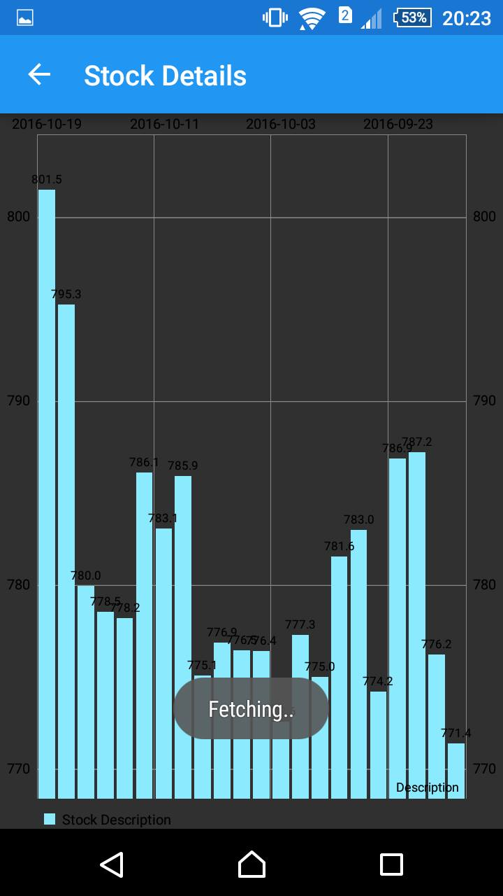
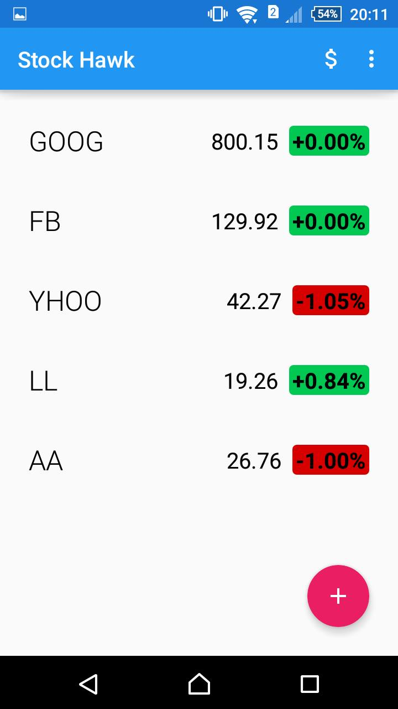

# Stock Hawk Android App ( Udacity Android Nanodegree project )

### Introduction

An Android App which displays stocks and on clicking a particular stock we get its relevant information using a library.

My work was to make it production ready ie. make it accessible by adding content description for each image view in the
xml files which makes it readable to partially blind people, localised by adding support for Arabic language, detect and rectify 
errors in the app and use a library to display the information of a relevant stock.

### Libraries Used

  1. Glide
  2. MPAndroid Chart
  

### Screenshots

### Contribution

Feel free to contribute and in case of any doubt contact me via email: *arpitdec5@gmail.com*
